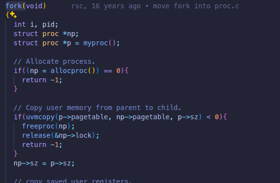
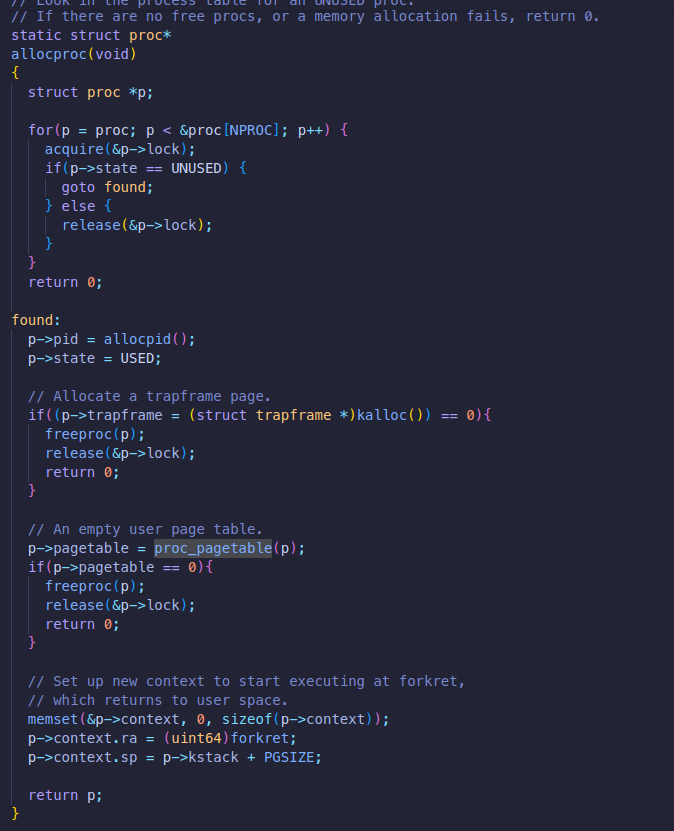
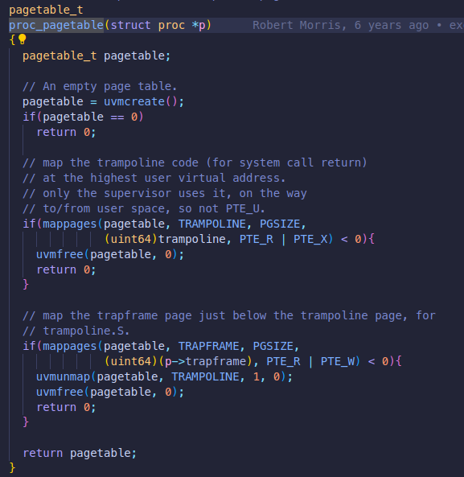
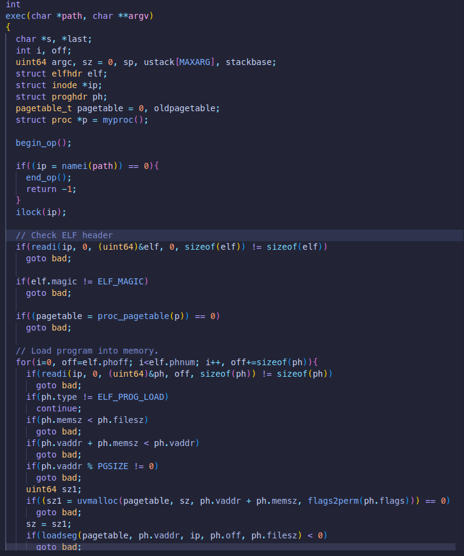
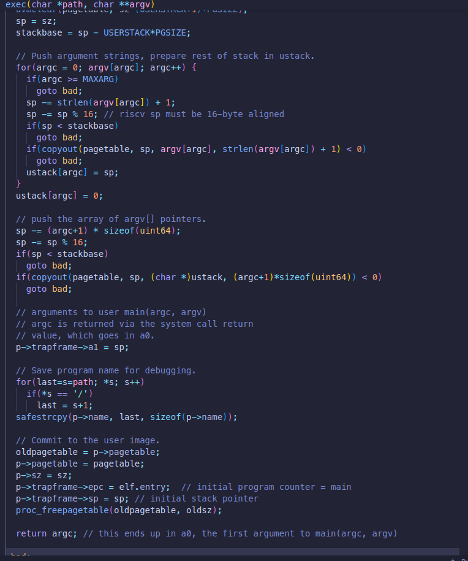

Let's go through the attacktest program step by step.
Firstly, it forks.
### Fork
Inside fork, it firsts calls `allocproc` function.


`allocproc` then calls `kalloc` for trapframe.



`proc_pagetable` is called to create a new page table for the new process.



Inside this, we see another page being allocated for pagetable of the process. After that, mapping is created for `TRAMPOLINE` and `TRAPFRAME` in the new page table. Since both these reside in the higher memory, their entries are present in the same third level pagetable.

So, in all, 4 pages are allocated in `allocproc` function.(trapframe-1,pagetable-3 and trampoline is common for all)

After that, we see that `uvmcopy` is being called which copies parent's memory to child's memory(excluding trampoline and trapframe as `uvmcopy` is used). This includes the stack, text, data and heap of the parent process. At this point, the parent has 4 pages allocated, so the child will also have these 4 pages+ 2 pages for 2nd and 3rd level pagetables(all are in lower memory and close enough to have entries in the same 3rd level pagetable).

So, `uvmcopy` allocated in total 6 pages.

So, fork allocates 10 pages in total.

### Exec
After fork, exec is called. 


The first allocation happens in `proc_pagetable` function. This is the same as the one we saw in fork. So, 3 pages are allocated here.

Then each segment inside program header is loaded in. This includes 2 load segments-data and text. Since these are in adjacent pages in memory, they will have entries in the same 3rd level pagetable. So, 2 pages are allocated for the pagetables and 2 for each of the segments. So, 4 pages in total.



Next memory is allocated for stack. In xv6, only 1 page is allocated for the stack and 1 guard page. Since these pages are just above the data segment, they will have entries in the same 3rd level pagetable. So, only 2 extra pages are allocated.

At the end, we can see `proc_freepagetable` being called. This is called to free the pagetables created by fork. So, 4 pages of memory(stack+guard and data+text) are freed. And then the pagetables are freed. So, 5 pages are freed.

So, in short, exec allocates 9 pages and then frees 9 pages.

## secret
The attacktest calls `exec` with `secret`. It allocates 32 pages and writes secret on 9th page(starting from 0). The attacktest then waits for the child to finish. The `wait` syscall frees the memory allocated by the child process. It calls `freeproc` on the child. It first frees the page for trapframe. It then calls `proc_freepagetable` to free memory allocated. It first frees text and data segment, followed by stack and guard page, 32 pages of heap. After this, it finally frees the pages containing the pagetables.

It is worth noting how xv6 maintains and uses the free memory. It maintains a free  linked list and newly freed pages are added to the head and pages are taken from the head for allocation.

## attack
After the wait, it then again forks and exec with `attack`. From the above discussion, we know, fork will take 10 pages in total. These will be 5 pages that previously had the pagetables and 5 pages from the 32 pages allocated in heap(page 31-27). The exec will then allocate 9 pages(page 26-18). Then it frees 9 pages. So, now the freelist would be:
```
9 pages-> page 17 of heap-> ... -> page 9 of heap -> ... -> page 0 of heap
```
So, we would need to allocate 9+(17-9) that is 17 pages so that our secret containing page is allocated again. So, then we just need to read from 32 bytes from the 16th page(0 indexed) to get the secret.

However, this attack would have failed if the secret was written at the start of a page as when freed, the 1st 8 bytes of a freed page are overwritten with the address of the next free page. So, the secret would have been overwritten.
